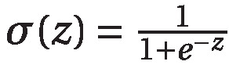
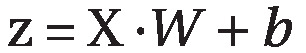
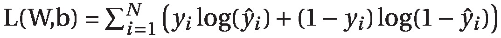

# MLStuff

## Gradient Descent
This project focuses on studying gradient descent and its applications in machine learning. The objective is to implement various algorithms and visualize their performance.

### Sigmoid Function
  
where Z is:  

### Log-Likelihood Function
  

The log-likelihood function ( L(W, b) ) measures how well the logistic regression model predicts the actual outcomes. We repeatedly maximize the gradients of ( L(W, b) ), optimizing the model parameters with respect to both the weights ( W ) and the bias ( b ).

### Gradients

need to add these

for a more indpeth write up see [this](files/gradient_descent.pdf)

